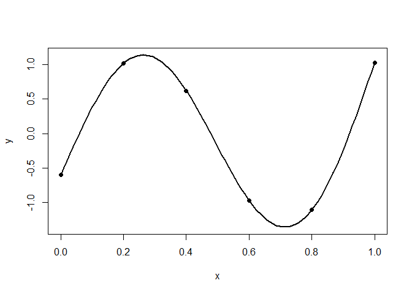
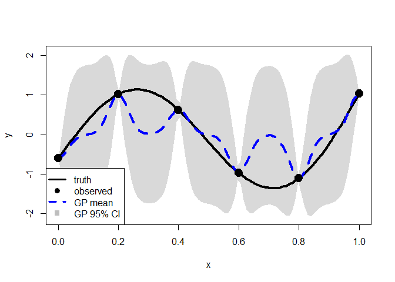
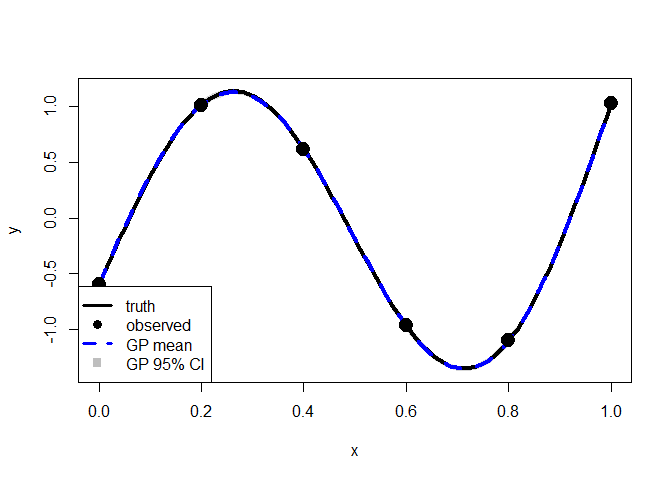

<!-- README.md is generated from README.Rmd. Please edit that file -->

# GPpenalty

<!-- badges: start -->
<!-- badges: end -->

The `GPpenalty` package in R provides maximum likelihood estimation for
Gaussian processes, supporting both isotropic and separable models with
predictive capabilities. Includes penalized likelihood estimation using
decorrelated prediction error (DPE)-based metrics, motivated by
Mahalanobis distance, that account for uncertainty. Includes cross
validation techniques for tuning parameter selection. Designed
specifically for small datasets.

## Installation

You can install the development version of GPpenalty like so:

``` r
install.packages("GPpenalty")
```

## Example

This is a basic example which shows you how to solve a common problem:

``` r
library(GPpenalty)
#> 
#> Attaching package: 'GPpenalty'
#> The following object is masked from 'package:stats':
#> 
#>     kernel
# one dimensional function 
f_x <- function(x) {
  return(sin(2*pi*x) + x^2)
}
```

Generate training and testing data.

``` r
n <- 6
n.test <- 100
x <- matrix(seq(0, 1, length=n), ncol=1)
y <- f_x(x)
x.test <- matrix(seq(0, 1, length=n.test), ncol=1)
y.test <- f_x(x.test)
# center and standardize response
y.test <- (y.test-mean(y))/sd(y)
y <- (y-mean(y))/sd(y)
# scale x
x.min <- apply(x, 2, range)[1,]
x.max <- apply(x, 2, range)[2,]
x <- (x - x.min)/(x.max-x.min)
x.test <- (x.test - x.min)/(x.max-x.min)

plot(x.test, y.test, type="l", xlab="x", ylab="y", lwd=2)
points(x, y, pch=19)
```



The black line is the true function and black dots represent the
observed points.

Now fit a model and use the MLE value as a plug in estimator for
prediction.

``` r
fit <- mle_gp(y, x)
p <- predict_gp(fit, x.test)
q1 <- p$mup - qnorm(0.025)*sqrt(diag(p$Sigmap))
q3 <- p$mup + qnorm(0.025)*sqrt(diag(p$Sigmap))

plot(x.test, y.test, type="l", xlab="x", ylab="y", lwd=2, ylim=range(q1, q3))
polygon(c(x.test, rev(x.test)), c(q1-0.04, rev(q3+0.04)), 
        col = rgb(0.7, 0.7, 0.7, 0.5), border = NA)
points(x, y, pch=19)
lines(x.test, y.test, lwd = 4, col = 1)
lines(x.test, p$mup, lwd = 4, col = "blue", lty = 2)
points(x, y, pch = 19, cex = 2)
legend("bottomleft", legend = c("truth", "observed", "GP mean", "GP 95% CI"), 
       lty = c(1, NA, 2, NA), col = c("black", "black", "blue", "gray"),
       lwd = c(3, NA, 3, NA), pch = c(NA, 19, NA, 15), pt.cex = 1.2,
       cex = 1,bty = "o", bg = "white")
```


The blue dashed line represents the predictive mean function and the
gray shaded area indicates the 95% CI. The CI appears inflated, and the
predictive mean function shows poor performance.

We are going to penalize the lengthscale parameter, theta.

``` r
set.seed(0)
# k-fold cross validation
# dpe metric
cv <- gp_cv(y, x, k=3)
pmle <- mle_penalty(cv)
penalized.p <- predict_gp(pmle, x.test)

q1 <- penalized.p$mup - qnorm(0.025)*sqrt(diag(penalized.p$Sigmap))
q3 <- penalized.p$mup + qnorm(0.025)*sqrt(diag(penalized.p$Sigmap))

plot(x.test, y.test, type="l", xlab="x", ylab="y", lwd=2, ylim=range(q1, q3))
polygon(c(x.test, rev(x.test)), c(q1-0.04, rev(q3+0.04)), 
        col = rgb(0.7, 0.7, 0.7, 0.5), border = NA)
points(x, y, pch=19)
lines(x.test, y.test, lwd = 4, col = 1)
lines(x.test, penalized.p$mup, lwd = 4, col = "blue", lty = 2)
points(x, y, pch = 19, cex = 2)
legend("bottomleft", legend = c("truth", "observed", "GP mean", "GP 95% CI"), 
       lty = c(1, NA, 2, NA), col = c("black", "black", "blue", "gray"),
       lwd = c(3, NA, 3, NA), pch = c(NA, 19, NA, 15), pt.cex = 1.2,
       cex = 1,bty = "o", bg = "white")
```



The tuning parameter, lambda, that minimizes the decorrelated prediction
error (DPE) reverts to the MLE. To encourage additional shrinkage, we
apply the one‑standard‑error rule.

``` r
pmle <- mle_penalty(cv, one.se = TRUE)
penalized.p <- predict_gp(pmle, x.test)

q1 <- penalized.p$mup - qnorm(0.025)*sqrt(diag(penalized.p$Sigmap))
q3 <- penalized.p$mup + qnorm(0.025)*sqrt(diag(penalized.p$Sigmap))

plot(x.test, y.test, type="l", xlab="x", ylab="y", lwd=2, ylim=range(q1, q3))
polygon(c(x.test, rev(x.test)), c(q1-0.04, rev(q3+0.04)), 
        col = rgb(0.7, 0.7, 0.7, 0.5), border = NA)
points(x, y, pch=19)
lines(x.test, y.test, lwd = 4, col = 1)
lines(x.test, penalized.p$mup, lwd = 4, col = "blue", lty = 2)
points(x, y, pch = 19, cex = 2)
legend("bottomleft", legend = c("truth", "observed", "GP mean", "GP 95% CI"), 
       lty = c(1, NA, 2, NA), col = c("black", "black", "blue", "gray"),
       lwd = c(3, NA, 3, NA), pch = c(NA, 19, NA, 15), pt.cex = 1.2,
       cex = 1,bty = "o", bg = "white")
```


